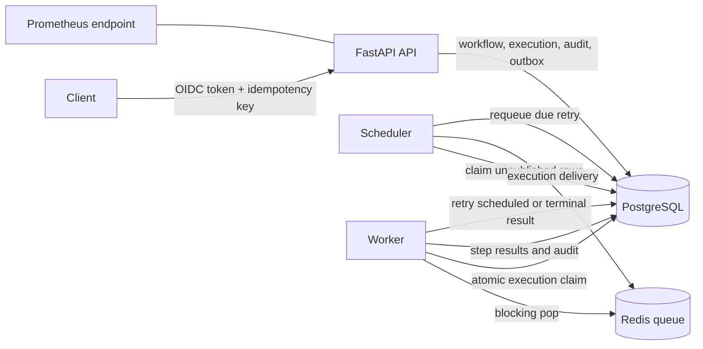
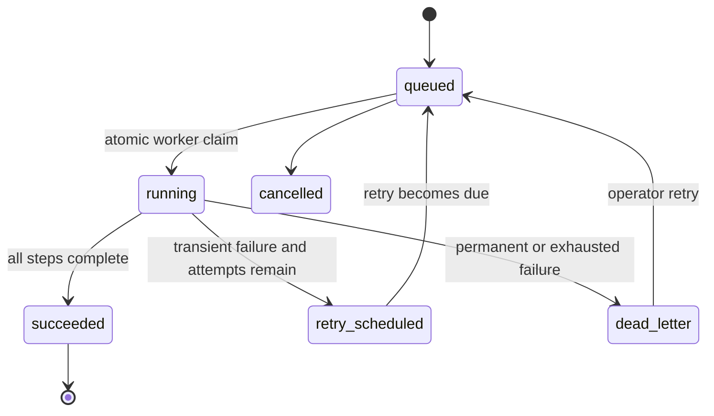

# Enterprise Automation Platform

A portfolio/reference implementation of a reliable workflow execution service. It demonstrates the architecture and failure-handling patterns behind enterprise process automation without claiming to be an original commercial system or exposing client implementations.

## Problem

Automation demos often stop after accepting a request and running a background function. Production systems also need to answer:

- Was the trigger accepted once or multiple times?
- Can queued work survive a broker or process failure?
- Who requested the execution and what changed?
- Which failures should retry, when, and how often?
- How does an operator inspect and recover terminal failures?
- Can two workers process the same delivery safely?

This repository makes those concerns explicit in the data model and execution state machine.

## Implemented scope

- Versioned workflow definitions with typed steps
- FastAPI `/api/v1` contract
- PostgreSQL schema managed by Alembic
- Transactional dispatch outbox
- Redis delivery queue
- Separate API, scheduler, and worker processes
- Durable interval schedules with concurrency-safe due-time claims
- HMAC-SHA256 webhook triggers with event-level idempotency
- Atomic worker claim protecting against duplicate delivery
- Expiring worker leases, heartbeats, fencing tokens, and bounded reaping
- Bounded exponential retry with deterministic jitter
- Dead-letter state and operator-triggered recovery
- Per-step execution history
- Append-only audit events with actor and correlation metadata
- OIDC/JWKS validation boundary and role-based API authorization
- Structured JSON logging and Prometheus metrics
- Docker Compose development environment

Supported reference step kinds are deliberately small: `assign`, `condition`, and `emit_event`. External connectors belong behind a separate adapter boundary; arbitrary URLs or executable code are not accepted in workflow definitions.

## Non-goals

- BPMN compatibility
- User-authored code execution
- A general-purpose message broker
- Multi-region consensus
- Claiming measured production scale or availability
- Kubernetes manifests before container-level behavior is stable

## Architecture



The database is the source of truth. Redis transports execution identifiers but does not own execution state.

### Execution state machine



## Reliability model

Delivery is **at least once**:

1. The API commits the execution and an outbox row in one database transaction.
2. The scheduler publishes an outbox row to Redis, then marks it published.
3. A crash between publish and acknowledgement can create a duplicate queue message.
4. The worker atomically changes only a `queued` execution to `running`; duplicate deliveries become no-ops.
5. A transient step failure is retried with bounded exponential backoff and deterministic jitter.
6. Permanent and exhausted failures enter `dead_letter` for inspection and explicit recovery.

This is not exactly-once processing. Side-effecting connector adapters must also use idempotency keys or an inbox/outbox contract at the external boundary.

## Quick start

Prerequisites: Docker Engine with Compose v2.

```bash
cp .env.example .env
docker compose up --build
```

The API is available at `http://localhost:8000`, OpenAPI at `/docs`, liveness at `/health`, readiness at `/ready`, and Prometheus metrics at `/metrics`.

Authentication is disabled for local development. Development requests receive the roles in `X-Dev-Roles` (default: `admin,operator,viewer`). This mode must not be used outside an isolated development environment.

### Create an active workflow

```bash
curl -X POST http://localhost:8000/api/v1/workflows \
  -H 'Content-Type: application/json' \
  -d '{
    "name": "employee-access-review",
    "description": "Reference workflow for an access review",
    "status": "active",
    "max_attempts": 3,
    "retry_base_seconds": 5,
    "steps": [
      {
        "name": "record-review-owner",
        "kind": "assign",
        "config": {"target": "review_owner", "value": "iam-operations"}
      },
      {
        "name": "check-risk",
        "kind": "condition",
        "config": {"field": "risk", "equals": "high"}
      },
      {
        "name": "emit-review-request",
        "kind": "emit_event",
        "config": {
          "event_name": "access.review.requested",
          "payload": {"source": "reference-workflow"}
        }
      }
    ]
  }'
```

### Trigger it idempotently

```bash
curl -X POST http://localhost:8000/api/v1/workflows/WORKFLOW_ID/executions \
  -H 'Content-Type: application/json' \
  -H 'X-Idempotency-Key: access-review-2026-09-10-user-42' \
  -H 'X-Correlation-ID: request-2026-09-10-user-42' \
  -d '{"input_payload": {"risk": "high"}}'
```

Submitting the same workflow and idempotency key returns the original execution with `Idempotent-Replay: true`.

### Schedule it

```bash
curl -X POST http://localhost:8000/api/v1/workflows/WORKFLOW_ID/schedules \
  -H 'Content-Type: application/json' \
  -d '{"interval_seconds": 300}'
```

The scheduler advances the due time with a conditional update, creates an idempotent execution and outbox row, then lets the normal dispatch path deliver it.

### Trigger it from a webhook

Send the raw JSON body to `/api/v1/workflows/{workflow_id}/webhook` with:

- `X-Webhook-Event-ID`: a stable provider event identifier;
- `X-Webhook-Signature`: `sha256=` followed by the HMAC-SHA256 hex digest of the raw body.

The signing secret must come from a managed runtime secret, not a workflow definition or source control.

## Authorization

| Capability | Roles |
|---|---|
| Create workflow definitions | `admin` |
| Trigger or retry executions | `admin`, `operator` |
| Read workflows, executions, and audit | `admin`, `operator`, `viewer` |

When `AUTOMATION_AUTH_ENABLED=true`, bearer tokens are validated against the configured OIDC issuer's JWKS endpoint, issuer, audience, and signature. The reference adapter reads realm or direct roles from the validated token.

## Development

```bash
python -m venv .venv
. .venv/bin/activate
python -m pip install -e '.[dev]'
alembic upgrade head
uvicorn app.main:app --reload
```

Run the worker and scheduler in separate terminals:

```bash
python -m app.worker
python -m app.scheduler
```

Quality commands:

```bash
ruff check app tests
mypy app
pytest --cov=app --cov-report=term-missing
```

## Documentation

- [Architecture](docs/architecture.md)
- [Failure model](docs/failure-model.md)
- [Threat model](docs/threat-model.md)
- [Operations runbook](docs/runbook.md)
- [Principal Engineer review](docs/principal-engineer-review.md)
- [ADR 001: Modular monolith](docs/adr/001-modular-monolith.md)
- [ADR 002: PostgreSQL source of truth](docs/adr/002-postgres-source-of-truth.md)
- [ADR 003: Transactional dispatch outbox](docs/adr/003-transactional-outbox.md)
- [ADR 004: Expiring worker leases](docs/adr/004-expiring-worker-leases.md)

## Roadmap

- Connector SDK with external idempotency contracts
- OpenTelemetry trace export
- PostgreSQL integration tests in CI
- Keycloak realm import and end-to-end authorization tests
- Operations UI after the API contract stabilizes

## License

MIT
